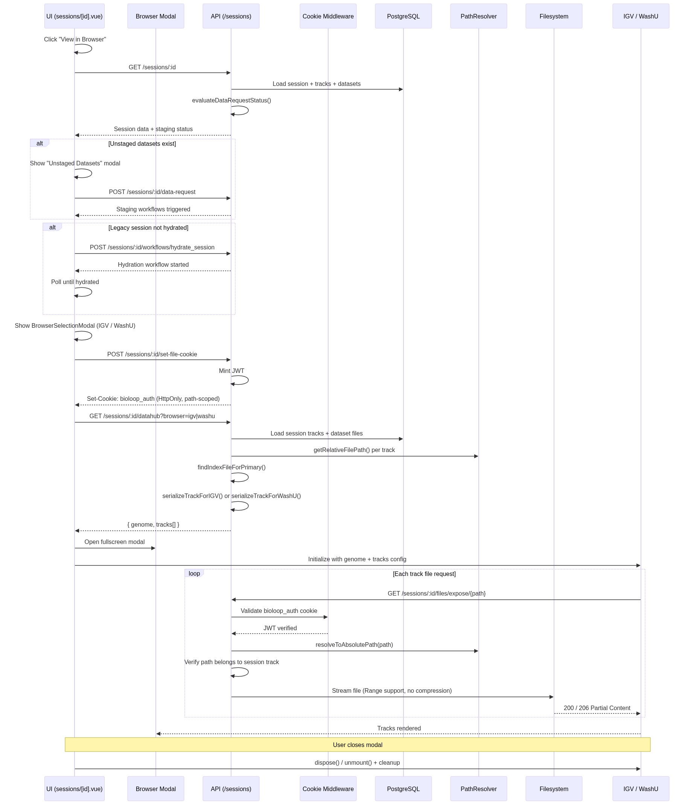
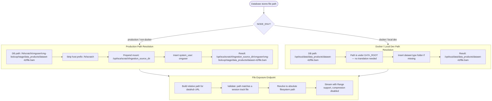
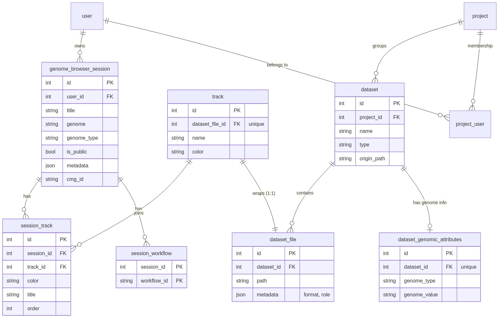

# Genome Browser Sessions & Tracks

## Overview

Sessions let users visualize genomic files from Bioloop-managed datasets inside
two embedded genome browsers — IGV.js and WashU Epigenome Browser — without
leaving the app.

## Architecture

### Components

- **UI** (`sessions/[id].vue`) orchestrates browser selection, cookie setup, datahub fetch, and browser rendering inside a fullscreen modal.
- **API** hosts session/track CRUD, a datahub endpoint that serializes tracks into browser-specific JSON, a cookie-scoped file exposure route, and staging/hydration workflow triggers.
- **Worker tasks** (`hydrate_session_tracks`, `finish_session_hydration`) populate track records for legacy sessions migrated from CMG MongoDB.
- **PostgreSQL** stores sessions, tracks, the session–track join table, and session–workflow associations.
- **PathResolver service** translates database-stored host paths into container-accessible filesystem paths, handling the production vs. local-dev mount difference.

### Objectives

- Let users group genomic files from different datasets into a single browser view.
- Support both IGV and WashU browsers from the same session with a single API, diverging only at the serialization layer.
- Serve binary genomic files (BAM, BigWig, VCF) securely to embedded browsers via same-origin cookie auth, avoiding CORS and token-in-URL complications.
- Make the feature accessible to all roles (user, operator, admin) with appropriate scoping.

## What Is a Session and What Is a Track

A **Track** wraps a single `dataset_file` with a display name. Each dataset file can have at most one track. Tracks are never deleted — they can only be associated with or disassociated from sessions.

A **Session** groups tracks together under a shared reference genome (e.g. `hg38`) so they render side-by-side in a browser. Sessions are owned by a user and optionally public. Session-level overrides (per-track color, per-track title, display order) live in the `session_track` join table.

### How Sessions Relate to Datasets

Tracks reference `dataset_file`, which belongs to a `dataset`. Genome information (organism type and assembly) lives on `dataset_genomic_attributes`, not on the track itself. A single session can therefore pull tracks from multiple datasets across multiple projects. Whether a dataset's files are available to a browser depends on whether the dataset is **staged** — the session detail page evaluates this dynamically.

## Request Flow

### 1. Create a Track

`POST /tracks` with a `name` and `dataset_file_id`. The API verifies the file exists and that the user has project-level access to the parent dataset. Operator/admin can create tracks for any file; user role is restricted to files in their projects.

### 2. Create a Session

`POST /sessions` with a `title`, `genome_type`, `genome` (assembly string), an array of `track_ids`, and an optional `is_public` flag. The API creates the session row and `session_track` join records in one transaction.

The UI's session creation form auto-populates `genome_type` and `genome` from the selected tracks' datasets when the fields are empty and all tracks share the same genome.

### 3. View a Session

`GET /sessions/:id` returns the session with nested tracks, datasets, workflow state, and a dynamically computed **data request status**:

- The API walks through every unique dataset referenced by the session's tracks.
- If all datasets are staged, `data_requested.all_staged` is `true` and the browser button is enabled.
- If unstaged datasets exist, the response indicates whether staging workflows are pending, complete, or not yet requested. The UI uses this to show a "Retry Staging" button or an "Unstaged Datasets" modal.

### 4. Open in Genome Browser

This is the core user flow, involving several coordinated steps:



1. **Pre-checks** — For legacy sessions (migrated from CMG, identified by `metadata.origin === 'legacy'`), the UI checks whether hydration has completed. If not, it offers to trigger the `hydrate_session` workflow. For any session with unstaged datasets, the "Unstaged Datasets" modal allows bulk-staging.

2. **Browser selection** — A modal presents IGV and WashU as radio options (default: IGV).

3. **Cookie setup** — The UI calls `POST /sessions/:id/set-file-cookie`. The API mints a standard JWT and stores it in an HttpOnly cookie named `bioloop_auth`, path-scoped to `/api/sessions/{id}/files/expose`. This cookie is what authenticates all subsequent file requests from the embedded browser.

4. **Datahub fetch** — The UI calls `GET /sessions/:id/datahub?browser=igv|washu`. The API loads all session tracks with their dataset files, resolves file paths, finds index files, and serializes each track into the format the chosen browser expects. The response is `{ genome, tracks }`.

5. **Browser initialization** — The UI opens a fullscreen modal and initializes the selected browser. IGV receives the datahub config directly. WashU receives it through a React-in-Vue wrapper. Both browsers then make HTTP requests to load file data from the file exposure endpoint.

6. **File serving** — Each browser request hits `GET /sessions/:id/files/expose/{path}`. The endpoint validates the cookie, confirms the requested file belongs to one of the session's tracks (by comparing path-resolver output), resolves the absolute filesystem path, and streams the file with range-request support and compression disabled.

7. **Cleanup** — When the user closes the modal, IGV is disposed (`browser.dispose()`) and WashU is unmounted (React root unmount + Redux store cache clear).

### 5. Legacy Session Hydration

Sessions migrated from CMG MongoDB arrive with `metadata.origin = 'legacy'` but without `session_track` join records. The `hydrate_session` workflow (two steps: `hydrate_tracks` → `finish_session_hydration`) populates the track associations from legacy metadata and sets `metadata.is_hydrated = true` on completion. The UI polls workflow status and blocks browser access until hydration completes.

## File Serving Architecture

### Why Cookies

Genome browsers make their own HTTP requests to fetch file data. They cannot attach `Authorization` headers. Cookie-based auth solves this: the browser automatically sends the HttpOnly cookie on every same-origin request.

### Router Mounting Order

The file exposure router (`fileExposureRouter`) is mounted at `/sessions` in `api/src/routes/index.js` **before** the global `authenticate` middleware. This is critical — it ensures file requests use the cookie middleware rather than requiring a Bearer token.

After the file exposure router, `authenticate` is applied, and then the main sessions router (which handles CRUD, datahub, etc.) is mounted at the same `/sessions` prefix.

### Path Resolution



The `pathResolver` service (`api/src/services/pathResolver.js`) handles the gap between what the database stores and what the filesystem exposes:

**Production:** The database stores host paths like `/N/scratch/cmguser/cmg-bioloop/stage/data_products/...`. Inside the API container, `/N/scratch` is mounted at `/opt/sca/scratch/ingestion_source_dir`. The resolver strips the host prefix, prepends the mount path plus the system username, and produces a container-accessible absolute path.

**Docker/local dev:** The database stores paths relative to `DATA_ROOT` (e.g. `/opt/sca/data`). No translation needed — the resolver may only insert a dataset-type folder (`data_products`, `raw_data`) if it is missing from the stored path.

`getRelativeFilePath({ dataset, datasetFile })` produces the relative path used in both datahub URLs and file exposure validation. `resolveToAbsolutePath(relativePath)` turns it into a filesystem path for streaming.

### Compression and Range Requests

Binary genomic files must not be compressed — genome browsers parse raw binary formats (BAM, BigWig) and cannot handle double-compression. Two layers enforce this:

1. The Express compression middleware in `app.js` skips any path containing `/files/expose`.
2. The file exposure handler itself sets `Content-Encoding: identity` and removes the `Vary` header.

Range requests (`Range: bytes=X-Y`) are supported: the handler responds with `206 Partial Content` and streams only the requested byte range. This is essential — browsers like IGV load BAM files by fetching specific byte ranges from the index rather than downloading the entire file.

### File Validation

The file exposure handler does not blindly serve any path. After loading the session with all its tracks, it computes `pathResolver.getRelativeFilePath()` for each track's primary file (and its index file, if any) and checks whether the requested path matches any of them. Requests for files not in the session are rejected with 404.

## Datahub Endpoint and Track Serialization

`GET /sessions/:id/datahub?browser=igv|washu` is the bridge between the session's track data and what each browser expects. The endpoint:

1. Loads the session with all `session_track → track → dataset_file → dataset` data.
2. Fetches all `dataset_file` records for the referenced datasets (needed for index file lookup).
3. Groups dataset files by `dataset_id` into a lookup map.
4. For each session track, calls the browser-specific serializer.

### File Type Mapping

`getGenomeBrowserFileConfig(filePath)` maps file extensions to browser-specific type values. Each entry returns `igv: { type, format }` and `washu: { type }`. For example, a `.bam` file maps to IGV `type: "alignment", format: "bam"` and WashU `type: "bam"`. A `.bw`/`.bigwig` file maps to IGV `type: "wig", format: "bigwig"` and WashU `type: "bigwig"`. Files with unrecognized extensions are skipped (serializer returns null, filtered out).

### Index File Resolution

`findIndexFileForPrimary()` (in `genomeBrowserUtils.js`) uses the `metadata.format` field on dataset files to locate sidecar index files. It consults `INDEX_TYPES_BY_MAIN_FORMAT` to know that BAM needs BAI/CRAI, VCF_GZ needs TBI/CSI, etc. It then matches by stripping index suffixes from filenames and comparing base names within the same directory. Self-indexed formats (BigWig, BigBed) have no expected index. When found, the index file's path is resolved and included as `indexURL` in the serialized track.

## IGV Browser Setup

### Technology

IGV is a pure JavaScript library (`igv` npm package, ^3.x). It renders into a plain DOM `<div>` — no framework adapter needed.

### Initialization

After the cookie is set and the datahub is fetched, the UI opens a fullscreen modal containing `<div id="igv-container">`. After Vue's `nextTick` (to ensure the DOM element exists), it dynamically imports `igv` and calls `igv.createBrowser(container, { genome, tracks })`. The tracks array from the datahub response is passed directly — no client-side transformation needed.

### Track Configuration Object (IGV)

IGV expects a flat object per track with both `type` and `format` as separate fields. Color and height are top-level properties. URLs are relative — IGV resolves them against the page origin.

```json
{
  "type": "alignment",
  "format": "bam",
  "name": "Sample Alignment",
  "url": "/api/sessions/42/files/expose/.../file.bam",
  "indexURL": "/api/sessions/42/files/expose/.../file.bam.bai",
  "color": "#2669a3",
  "height": 100
}
```

A common mistake: for BigWig files, IGV requires `type: "wig"` and `format: "bigwig"`. Using `type: "bigwig"` causes a "Could not determine track type" error.

### Cleanup

On modal close: `igvBrowser.dispose()`, reference nulled.

## WashU Epigenome Browser Setup

### Technology

WashU (`wuepgg` npm package) is a React component. Since Bioloop is a Vue 3 app, WashU is embedded using a manual React-in-Vue mounting pattern in `WashUBrowser.vue`. Additional dependencies: `react`, `react-dom`, `json-stable-stringify`.

### Initialization

After cookie setup and datahub fetch, the UI increments a `washuMountKey` ref (forcing Vue to destroy and recreate the wrapper component) and opens the fullscreen modal. The `WashUBrowser.vue` component mounts automatically via `v-if` and handles all React lifecycle:

1. **Purge localStorage** — WashU internally uses `redux-persist`. Without cleanup, old track state rehydrates on subsequent mounts ("zombie tracks"). The component removes all `persist:*` localStorage keys on mount.

2. **Import and mount** — Dynamically imports `wuepgg`, extracts `GenomeHub` (defensive: `mod.default ?? mod.GenomeHub`), creates a React root via `createRoot(container)`, and renders `createElement(GenomeHub, props)`.

3. **URL conversion** — WashU uses Web Workers for data fetching. Workers cannot resolve relative URLs, so the component converts all track URLs to absolute (`new URL(url, window.location.origin)`).

4. **Disable persistence** — Each mount uses a unique `storeId` (`bioloop-washu-${Date.now()}`) with `enablePersistence: false` to prevent Redux from writing to localStorage.

5. **Stable React key** — A deterministic key is computed from the genome + serialized tracks. This forces React to fully remount when tracks change rather than attempting a state reconciliation.

### Track Configuration Object (WashU)

WashU uses `type` only (no `format` field). Track options (color, height) are nested inside an `options` object. Unlike IGV, URLs must be absolute.

```json
{
  "type": "bigwig",
  "name": "Sample Signal",
  "url": "https://host/api/sessions/42/files/expose/.../file.bw",
  "indexURL": "https://host/api/sessions/42/files/expose/.../file.bam.bai",
  "options": {
    "color": "#2669a3",
    "height": 100
  }
}
```

### WashU-Specific Pitfalls

- **React-Vue event isolation:** React click events bubble into Vue's event system and can dismiss the parent modal. The modal uses `@click.stop @mousedown.stop` on the WashU container div and sets `:disable-attachment="true"` plus `no-outside-dismiss` on the `va-modal`.
- **Zombie tracks:** Without the localStorage purge + unique storeId + disabled persistence, tracks from a previous session reappear. All three mitigations are needed.
- **Component not found:** `wuepgg` exports vary by version. The defensive `mod.default ?? mod.GenomeHub` import handles both default and named exports.

### Cleanup

On modal close: `clearAllStoreCaches()` (WashU's exported function for clearing global Redux store caches), then `reactRoot.unmount()`, reference nulled.

## IGV vs. WashU — Key Developer Differences

| Concern | IGV | WashU |
|---------|-----|-------|
| Runtime | Pure JS, no framework | React 18 wrapped in Vue |
| Mount | `igv.createBrowser(div, opts)` | `createRoot(div).render(createElement(...))` |
| Track type field | `type` + `format` (both required) | `type` only |
| BigWig config | `type: "wig", format: "bigwig"` | `type: "bigwig"` |
| BAM config | `type: "alignment", format: "bam"` | `type: "bam"` |
| Color/height | Top-level flat fields | Nested under `options` |
| URL requirement | Relative (page-origin resolved) | Absolute (Web Workers) |
| State across mounts | Stateless | Redux-persist; must disable |
| Cleanup | `dispose()` | `clearAllStoreCaches()` + `unmount()` |
| Event quirks | None | Requires click/mousedown stop-propagation |
| Remount strategy | Re-call `createBrowser` | Increment Vue `:key` + React `key` |

The API datahub endpoint returns different JSON shapes for each browser (controlled by the `?browser=` query param), but both shapes share the same outer structure `{ genome, tracks }` — only the individual track objects differ as described above.

## Data Model



### `genome_browser_session`

- Owned by a `user`. Stores `title`, `genome` (assembly), `genome_type` (organism), `is_public`, and `metadata` (JSON — carries `origin`, `is_hydrated`, and legacy CMG data).
- `cmg_id` links to the original CMG MongoDB ObjectId for migrated sessions.

### `track`

- 1:1 with `dataset_file` (unique constraint on `dataset_file_id`).
- Stores `name` and optional `color`.
- Genome info is not on the track — it is accessed via `dataset_file → dataset → dataset_genomic_attributes`.

### `session_track` (join table)

- Links sessions to tracks with per-association overrides: `color`, `title`, `order`.
- Unique constraint on `(session_id, track_id)`.

### `session_workflow`

- Links sessions to Rhythm workflow IDs. Composite PK `(session_id, workflow_id)`.
- Used for the `hydrate_session` workflow on legacy sessions.

### Supporting models

- **`dataset_file`** — `path` (relative within dataset), `metadata` JSON (carries `format` and `role` fields populated by the `file_info_population` workflow).
- **`dataset_genomic_attributes`** — 1:1 with `dataset`; holds `genome_type` and `genome_value`.
- **`dataset_file_hierarchy`** — parent/child relationships between files; used to associate primary files with their index files (e.g. BAM → BAI).

## Access Control

Sessions and Tracks are accessible to all roles (user, operator, admin), with scoping:

- **admin/operator** see all sessions and all tracks.
- **user** sees only sessions they own and only tracks from datasets in projects they belong to. The API enforces this via `sessionOwnerFn` (resolves session owner username for middleware) and `track_access_check` (verifies project membership through `track → dataset_file → dataset → project → project_user`).

The Pinia stores automatically route list requests to the correct endpoint: `GET /sessions` for admin/operator vs. `GET /sessions/:username/all` for user role.

## Feature Flag

The feature is gated by `enabled_features.genome_browser` in `api/config/default.json` (default `true`). When enabled, track listing endpoints filter to files with `metadata.role = 'PRIMARY'` — only files classified by the `file_info_population` workflow as primary data files, not index files, appear in track selection.

Sidebar items for Sessions and Tracks are in the `user_items` array in `ui/src/constants.js`, gated on `feature_key: 'genome_browser'`.

## Workflow Registry

The `hydrate_session` workflow is registered in `api/config/default.json`:

```json
"hydrate_session": {
  "name": "Hydrate Session",
  "description": "Hydrate legacy CMG Session with Tracks",
  "steps": [
    { "name": "hydrate_tracks", "task": "hydrate_session_tracks" },
    { "name": "finish_hydration", "task": "finish_session_hydration" }
  ]
}
```

The workflow is created via `POST /sessions/:id/workflows/hydrate_session`, which calls Rhythm and records the workflow ID in the `session_workflow` table.

---

### Deployment Notes

#### 1. Database Migration

The session/track tables (`genome_browser_session`, `track`, `session_track`, `session_workflow`) are part of the Prisma schema. If deploying to a database that predates this feature:

```bash
# exec inside `api` container:
docker compose exec api bash
# run inside `api` container:
npx prisma migrate deploy
npx prisma generate
```

Restart the API after migration.

#### 2. Environment Variables

Ensure these are set for production (required by `pathResolver.js`):

```
# 📄 api/.env (or container environment)

FILESYSTEM_BASE_DIR_SCRATCH=/N/scratch
FILESYSTEM_MOUNT_DIR_SCRATCH=/opt/sca/scratch/ingestion_source_dir
```

The `system_user.username` config value must match the user whose home directory contains staged data (default: `cmguser` in `api/config/default.json`).

#### 3. Feature Flag

Verify `enabled_features.genome_browser` is `true` in the API config. It is enabled by default in `default.json`, but check that environment-specific overrides haven't disabled it.

#### 4. Volume Mounts

The API container needs read access to staged genomic files. Ensure the docker-compose file mounts the staging directory:

```yaml
# 📄 docker-compose-prod.yml
api:
  volumes:
    - ${FILESYSTEM_BASE_DIR_SCRATCH}:${FILESYSTEM_MOUNT_DIR_SCRATCH}
```

#### 5. NPM Dependencies (UI)

These packages must be installed for genome browser rendering:

- `igv` (^3.x)
- `wuepgg` (WashU Epigenome Browser)
- `react` (^18.x)
- `react-dom` (^18.x)
- `json-stable-stringify`

#### 6. Worker Tasks

The `hydrate_session_tracks` and `finish_session_hydration` Celery tasks must be deployed and registered in the worker. These are only needed for legacy CMG session migration — new sessions created through the UI do not use them.

#### 7. Cookie Security

The file access cookie (`bioloop_auth`) sets `secure: true` when `NODE_ENV === 'production'`. Nginx must be serving over HTTPS for the cookie to be sent by the browser.

---

### Post-Deploy Smoke Test

1. Create a track from a staged dataset file.
2. Create a session referencing that track, selecting the correct genome.
3. Open the session, click "View in Genome Browser", select IGV.
4. Confirm tracks load and file data renders.
5. Close the modal, reopen with WashU, confirm the same.
6. For legacy session testing: find a session with `metadata.origin = 'legacy'`, trigger hydration, confirm tracks populate after workflow completion, confirm browser loads.
